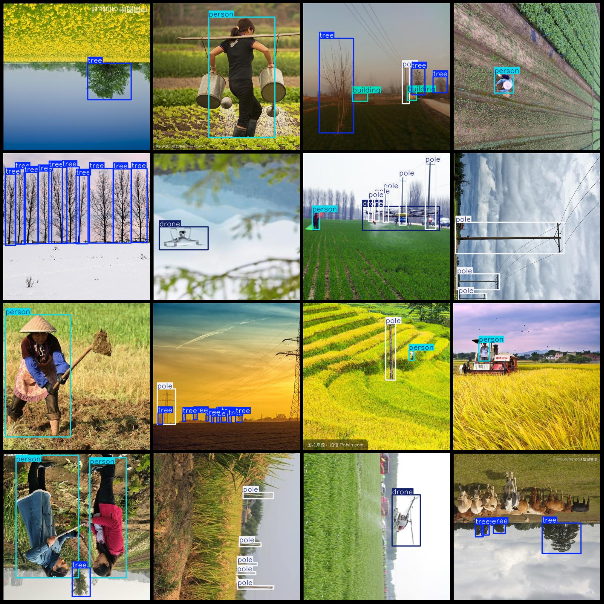
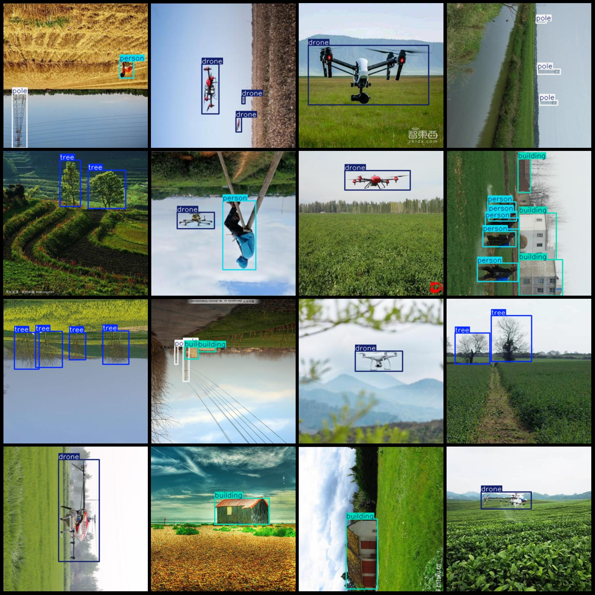

# Vegetation Protection Drone Obstacle Detection Data Set (VOC+YOLO) in 3665 Images, with 5 Categories

Dataset format: Pascal VOC format + YOLO format (without split path in txtfile, only contain jpgimage and corresponding VOC format xmlfile and yolo format txtfile)
number of images: 3665  
Annotations number is 3665.
annotation count: 3665
The number of categories is 5.
The annotation class names are: ["building", "drone", "person", "pole", "tree"].
The number of boxes annotated in each category:
Building box count = 1697
The drone has 907 frames.
The person box count is 1656.
The pole box count is 2970.
The tree box count is 3430.
total boxes: 10660  
images per class:   
building images = 874  
drone images = 731  
person images = 895  
pole images = 1313  
The number of images owned by the tree is 1335.
image resolution: 416x416  
Using the annotation tool: labelImg
Annotation rules: draw a rectangle around the class.
Important notes: The dataset does not have a separate training, validation, and test set; you need to partition it yourself.
Special statement: This dataset does not guarantee any accuracy in the trained model or weight file.
image preview:
## Images

Here is a pay link on Stripe ( https://buy.stripe.com/3cs8yP7sY87d0vu9AB ). Please contact me lonlonago@foxmail.com after funding $89, and I will send you a complete data files , thank you!

